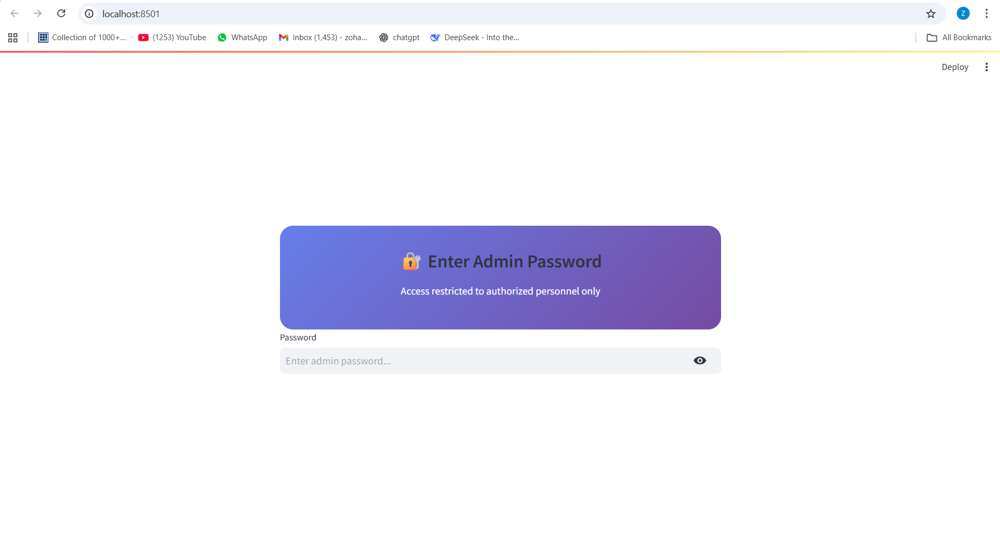
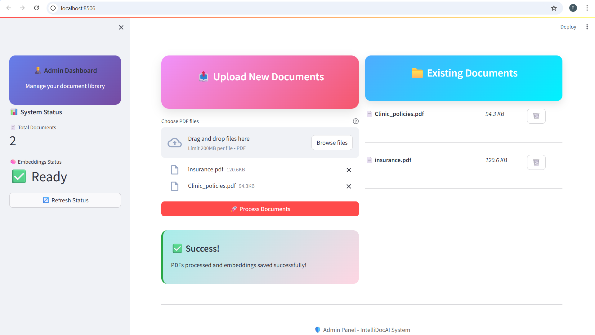
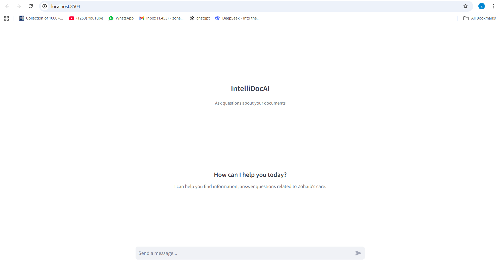
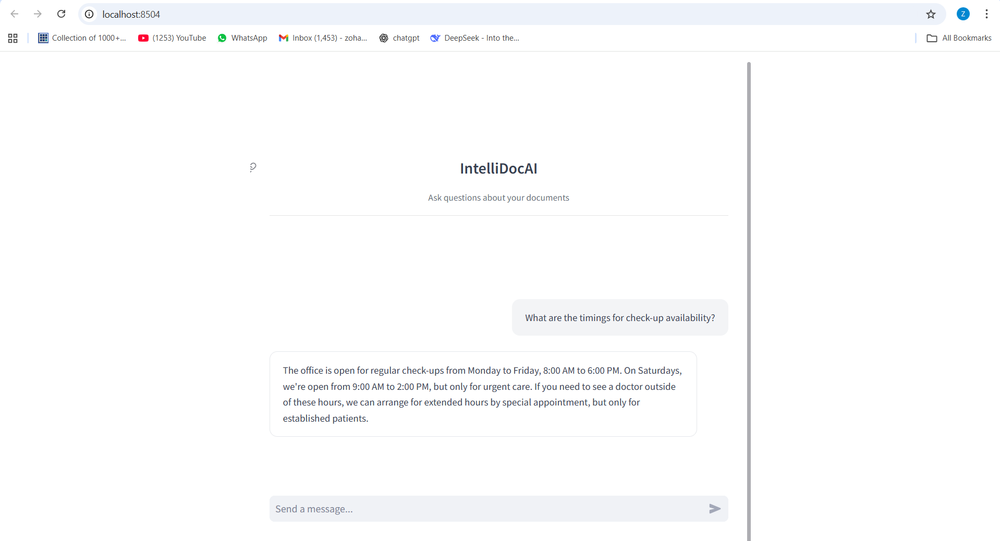

# IntelliDoc AI: document Q&A with admin and user roles

IntelliDoc AI is a retrieval-augmented generation (RAG) application for PDF documents. It has two
roles:

* **Admin:** uploads PDFs, builds the search index and deletes documents.
* **User:** asks questions about all documents in the library and gets answers in a chat.

The documents stay available between sessions because the app saves the index to disk.


## How it works

```
PDF upload -> text extraction -> chunking -> embeddings -> FAISS index (saved) -> retrieval -> LLM answer
```

| Part | Tool |
|---|---|
| PDF text extraction | PyMuPDF |
| Chunking and RAG chain | LangChain |
| Embeddings | `sentence-transformers/all-MiniLM-L6-v2` (Hugging Face) |
| Vector store | FAISS |
| LLM | Groq API, model `llama3-70b-8192` (set in `chatpdf.py`) |
| User interface | Streamlit (two separate apps) |

## Screenshots

**Admin interface**




**User interface**




## Setup

Requirements: Python 3.8 or later and a Groq API key from [console.groq.com](https://console.groq.com).

1. Get the code and install the dependencies:
   ```bash
   git clone https://github.com/zohaibNaseem/Intellidoc_AI-Role-based-access.git
   cd Intellidoc_AI-Role-based-access
   pip install -r requirements.txt
   ```
2. Copy `.env.example` to `.env`. Then set your values:
   ```
   GROQ_API_KEY=your_groq_api_key_here
   ADMIN_PASSWORD=choose_a_strong_password
   ```
   Do not commit the `.env` file. The `.gitignore` file blocks it.
3. Start the admin app:
   ```bash
   PYTHONPATH=. streamlit run admin_app/app.py --server.port 8501
   ```
   On Windows PowerShell, set the path first: `$env:PYTHONPATH = "."`.
4. In a second terminal, start the user app:
   ```bash
   PYTHONPATH=. streamlit run user_app/app.py --server.port 8502
   ```

## Use

**Admin** (`http://localhost:8501`)
1. Enter the password from `ADMIN_PASSWORD`.
2. Select one or more PDF files. Click "Process Documents".
3. Examine the document list. Delete the documents that you do not need.

**User** (`http://localhost:8502`)
1. Type a question about the documents.
2. Ask follow-up questions. The chat keeps the conversation history.

## Sample data
The `data/` folder contains two sample documents for a fictional clinic ("ZohaibCare Plus"). The
`embeddings/` folder contains the index for these documents. Thus you can test the user app at once.

## Limits
* The admin login uses one shared password. It is not a full user-management system.
* The index is a local file. More than one server cannot share it.
